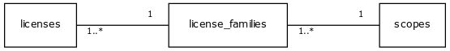
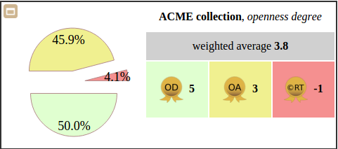
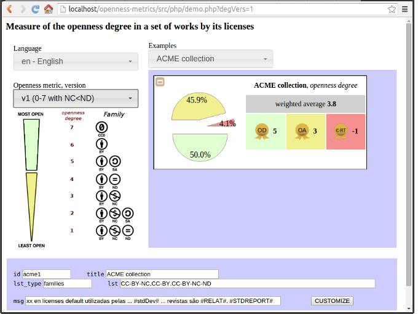

## How much open is it?
This project is an initiative to shift the traditional conversations about [Open access](https://en.wikipedia.org/wiki/Open_access), from “All here is open access?”, “How to compare open things?”... to "How much open is this set?",  and transform consensual answers into concrete things!

Document collections, full repositories, set of articles in a journal issue, set of documents in a list of references, set of projects of a Github user, set of images of a Wikimedia category... About any kind of set, any kind of creative work, we can ask *"How much open is it?"*.

This project is a technical response, creating a reference-database, foundations for *openness metrics*, and a concrete kit of online tools. Differing from [OAS](http://www.oaspectrum.org) the focus of this tools are the autit of license type of each document, and distribution of license types over the set of documents. The project use the most simple and objective aproach: an average of the "openness degree" of each element of the set. So, we have two main working lines:

* to keep a [dataset](https://github.com/datasets) of reliable license descriptors with reliable metadata about *license family* and about most [commom/consensual measure of "openness degree"](https://commons.wikimedia.org/wiki/File_talk:Ordering_of_Creative_Commons_licenses_from_most_to_least_open.png#Suggestion_for_ordering_by_an_openness-degree_criteria) of each family of lincenses.

* establish a mathematical criterion and a database (SQL) tool, to do the averages subsidizing pretty reports.

# Prepare

Feed the database, and install the demo and webservice as a `ometrics` in the http server (ex. folder `html` of standard Apache),

```
cd yourSandBox
git clone https://github.com/ppKrauss/licenses.git
git clone https://github.com/ppKrauss/openness-metrics.git

nano openness-metrics/src/php/ini.php    # change configs as $projects paths
nano openness-metrics/src/php/omLib.php  # change configs as $PG_PW

php openness-metrics/src/php/ini.php     # feed database
mv openness-metrics/src/php /var/www/html/ometrics
mv openness-metrics/src/assets /var/www/html/ometrics
sudo chmod -R g+rwx /var/www/html/ometrics

rm -r openness-metrics; rm -r licenses # optional
```

# Summary of the Openness-metrics project
A mini-framework to check the license of a work (document, software and others), express its openness degree, and calculate the average of openness degree of a set of works. All in a SQL service with JSON front-end, and PHP/Python/Javascript/AnyOther driver to enable pretty reports and other uses.

The main sources of this project are:

* [families](data/families.csv): Families of licenses and openness degree definition (many def versions). [Get original sources as formated spreadsheet or comment here](https://docs.google.com/spreadsheets/d/1nf3vFHcLpgVTcFbUJp8pL3H8fsBFvjrWA07AI2JZtk8/edit?usp=sharing).

* [licenses](https://github.com/ppKrauss/licenses): licenses dataset, to feed the PostgreSQL database.



# Using
Examples of how to use the library with the database or directly as webservice. For more details, see documentation embedded in source code, the main one is [src/ini.sql](https://github.com/ppKrauss/openness-metrics/blob/master/src/ini.sql).

## Services in SQL

Check and format services

```sql
-- Format a license name string
SELECT om.licname_format(' cc-by SA --v3 '); -- 'cc-by-sa-3'
-- Sanitize a list of pairs name-quantity (with opt flag for families)
SELECT om.nameqts_std( '{"CC by-v3":10,"CC-BY3":1,"CC BY-NC 4":1}'::json);
       -- {"cc-by-nc-4":1, "cc-by-3":11}
-- Check if a license name exist in the database (NULL if not, the standard name if exists)
SELECT om.licname_to_name('apache 2'), om.licname_to_name('GPL 5'); -- 'Apache-2.0', NULL

-- ... check a list of license names.
SELECT om.licname_to_name(array['cc by v3','gpl5','apache2']) -- array ['CC-BY-3.0',NULL,'Apache-2.0']

-- Format a family name string
SELECT om.famname_format(' CC BY-nc-ND '); -- 'cc-by-nc-nd'
-- ... check a list of family names.
SELECT om.famname_to_id(array['CC0','xyz','CC by-nc ']); -- array [4,NULL,10]
```

Information retrieval services
```sql
-- Get (in JSON) all existing information about a family, by name or by id
SELECT om.famname_to_info('cc  BY'), om.fam_to_info(6);  -- both {"fam_id":6,"fam_name":"cc-by", ...}

-- Get a complete JSON "average results" report from JSON input of a family list.
SELECT om.famqts_calc( '{"CC-by":13,"CC by sa":5,"CC-BY":15,"CC-BY":5}'::json , 1);
       -- {"aggtype":"family","qt_tot":38,"deg_version":1,"n_valids":2, ... }

-- Get a complete JSON "average results" report from JSON input of a license-name list.
SELECT om.licqts_calc('{"CC-by3":2,"CC-by2":3,"CC by sa3":5,"CC-BY v4":15}'::json);
       -- {"aggtype":"license","qt_tot":25,"deg_version":2,"n_valids":4, ...}
```
The input of *average report* functions are key-value pairs with valid names as keys and "license quantities" (ex. number of documents with same license) as values.

## Basic webservices
The natural insterface is POST JSON request, but some GET variations are offered.  All the examples can be adpted to pretty REST syntax using Apache2's `.htaccess` file or another HTTP server configuration. Below using the [PHP driver](./src/php) to illustrate [OpenURL style](https://en.wikipedia.org/wiki/OpenURL) for webservice calling.

 1. `ws.php?families=cc-by;cc-by-nc;cc0;cc-by;cc-by-sa;cc0;cc-by-nd;cc0&degvers=2` returns the same as `ws.php?cmd=famqts_calc&list=...`  or SQL's `SELECT om.famqts_calc( '{cc-by,cc-by-nc,cc0,cc-by,cc-by-sa,cc0,cc-by-nd,cc0}'::text[] , 2)`

 2. `ws.php?licenses=cc-by2;cc-by-nc3;cc0,cc-by2;cc-by-sa3;cc0,cc-by2;cc0&degvers=2` returns the same as `SELECT om.licqts_calc( '{cc-by2,cc-by-nc3,cc0,cc-by2,cc-by-sa3,cc0,cc-by2,cc0}'::text[] , 2)`

 3. `ws.php?method=licname_to_name&list=cc-by2;cc-by-nc3;cc0,cc-by2;cc-by-sa3` returns the same as `SELECT om.licname_to_name( '{cc-by2,cc-by-nc3,cc0,cc-by2,cc-by-sa3}'::text[])` ... The `method` parameter can be the name of any `om.lic*()` or `om.fam*()` [SQL functions](./src/ini.sql).

## Pretty report services

For final users, the JSON, numbers or tables are not pretty. Communication about *openness degree of a set of documents* (or any other type of licensed work) must be simple and illustrative, emphasizing the different results, about general average and about contextual average, because there are qualitative distinctions in the numbers of each context.



A typical report must show a pie chart of the distribution of the elements in each scope, the version of the *openness degree scale* used in the report, the general *openness degree average* of the set, and *openness degree averages* of each scope. Standard colors and icons also helps to compare and fastly understand the results. The standard report text also need some multilingual support.



The [demo](src/php/demo.php) shows a more complete contextualization, use of box-report interface, and use of the service parameters for [AJAX](https://en.wikipedia.org/wiki/Ajax_(programming)) contexts.

# Links and references

* Open Access Organizations
 * [DOAJ](https://doaj.org/) - Directory of Open Access Journals
   * http://www.oaspectrum.org/faq
   * http://www.oaspectrum.org/api
 * [OAS](http://www.oaspectrum.org/) - Open Access Spectrum
 * [SPARC](http://sparcopen.org/) - the Scholarly Publishing and Academic Resources Coalition
   * http://www.sparc.arl.org/blog/announcing-open-access-spectrum-oas-evaluation-tool
   * https://community.cochrane.org/editorial-and-publishing-policy-resource/open-access#HowOpenScale
 * [OASPA](http://oaspa.org/) - Open Access Scholarly Publishers Association

* Initiatives (projects, programs, etc. of the organizations)
 * http://www.howopenisit.org The "HowOpenIsIt?" program is a family of resources and services ... as OAS. Was developed by PLOS, SPARC, and OASPA.
 * http://ananelson.github.io/oacensus/
 * https://www.plos.org/wp-content/uploads/2014/10/hoii-guide_V2_FINAL.pdf

* Scientific Open Access content (articles)
 * [SciELO](http://www.scielo.org/) - half million of articles
 * [PubMed Central](http://www.ncbi.nlm.nih.gov/pmc/) - 3.7 million of articles

* Other
 * [Ordering of Creative Commons licenses](https://commons.wikimedia.org/wiki/File:Ordering_of_Creative_Commons_licenses_from_most_to_least_open.png) - ordering of CC licenses illustration
 * ...
